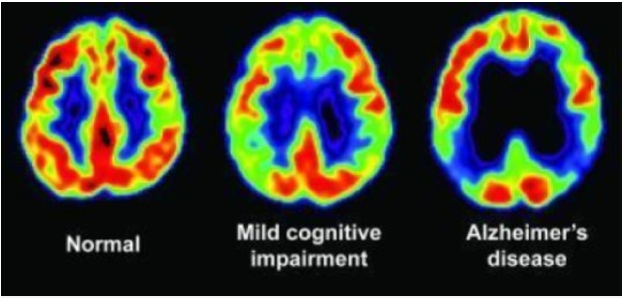
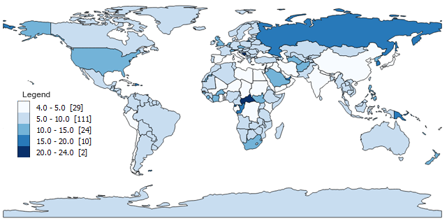
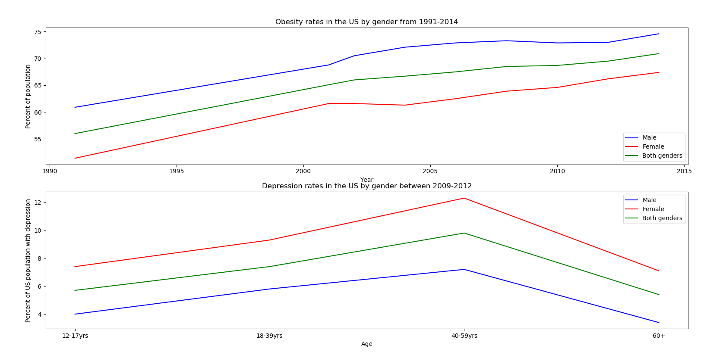
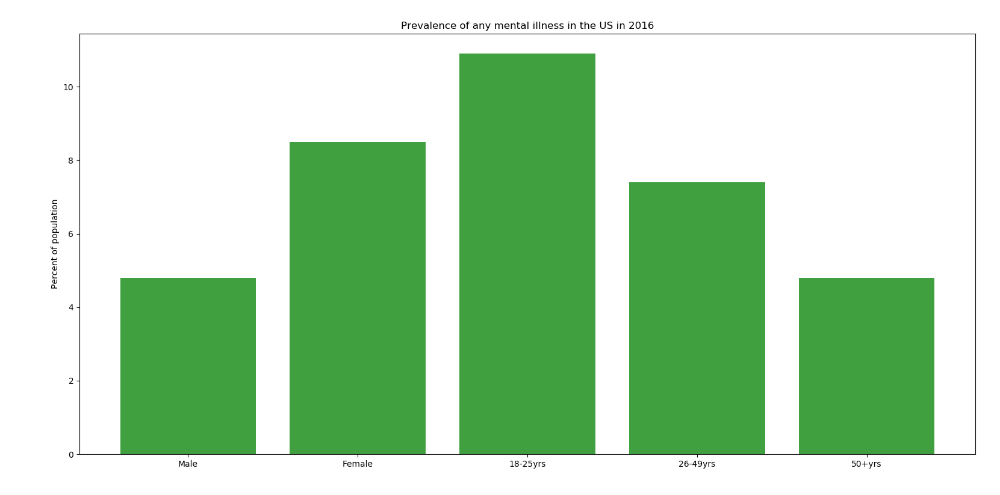
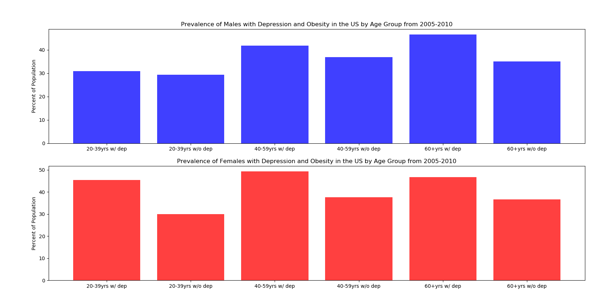
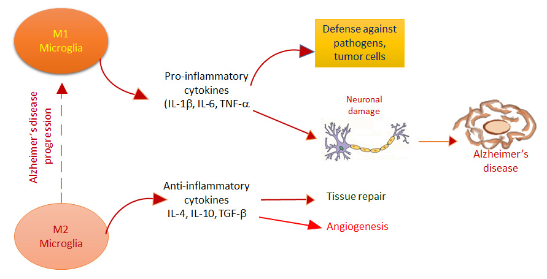

% _MIB TEAM PROJECT_
_____________
Members: Louise Stolz, Fernanda Juarez, Xuefeng Yan

# _**Purpose of this project:**_
Our lab studies diseases related to neuroinflammation and depression using PET neuroimaging.
Our research has shown that there is a relationship between neuroinflammation and depression however, for this project, we wanted to
see if there was a correlation between depression and obesity.

Studies have shown that certain parts of the brain, for example the hypothalamus, hippocampus, cortex, brainstem, and amygdala, are affected by obesity-derived neuroinflammation.

The following project presents four graphs of **obesity and mental health** prevalence in the United States.
We have compared gender and age group across the US over time in an attempt to better understand the link between the two diseases.

____________________________________________________

# **Background and Relevance**
- Need for better understanding of links and more targeted treatments
- Depression is the leading cause of disability and obesity is the second leading cause of death
- Obesity: cytokines, chemokines 

___________________________________________________

# **Coding Process**
- Tried to create the best graphs for the data presented
- Limitations

_______________________________________________________

# **GRAPHS**

##### Figure 1 shows obesity and depression rates over time for adults.

##### Figure 2 shows the prevalence of any mental health disorder in 2016 by gender and various age groups

#### Figure 3 shows the prevalence of people with both obesity and depression by age group and gender

__________________________________________________________
# **Conclusions**

- Future directions: Understanding the data, presenting it effectively - leads to acknowledgement for better treatments

